<div align="center">

# 🏦 NeoBank — Premium Digital Banking & Personal Finance App

**A showcase-only Flutter project built with FlutterFlow & Firebase, tailored for the Tunisian market (TND).**

> ⚠️ **SOURCE CODE IS NOT AVAILABLE** — This repository is a **portfolio showcase** of the application's architecture, design, and advanced business logic. The full source code is intentionally withheld. All screenshots and documentation are provided for demonstration purposes only.


</div>

---

## 📸 App Gallery

| Dashboard — Dark Mode | Dashboard — Light Mode | Card Management |
| :---: | :---: | :---: |
| 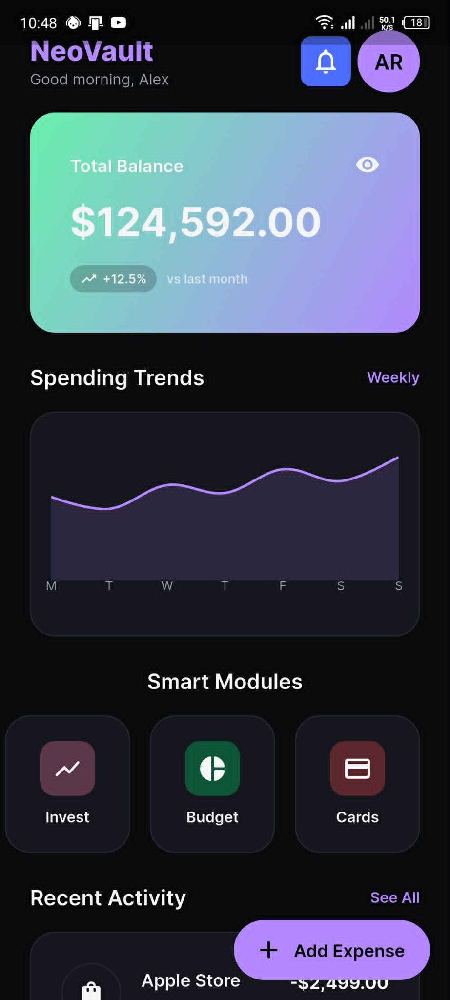 | 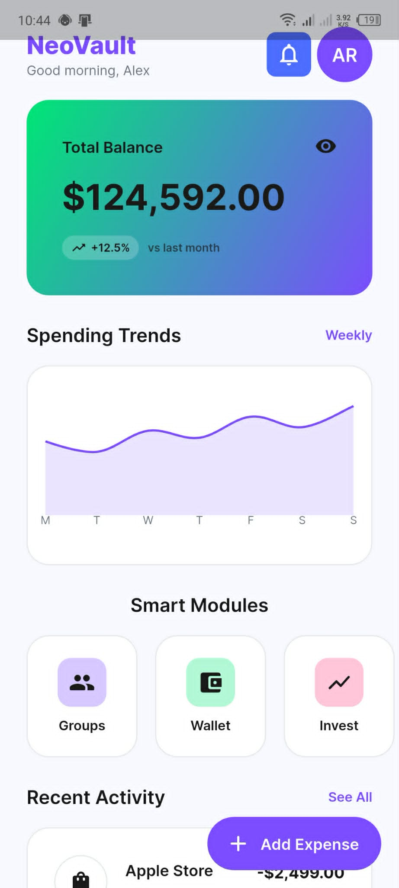 | 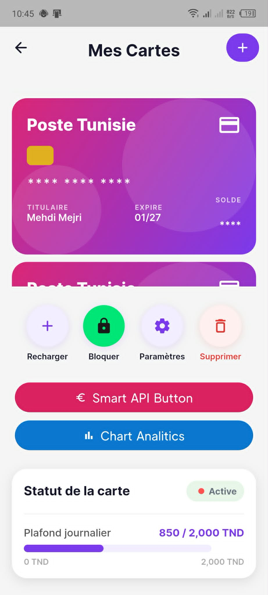 |

| Sign In | Sign Up | Settings & KYC |
| :---: | :---: | :---: |
| 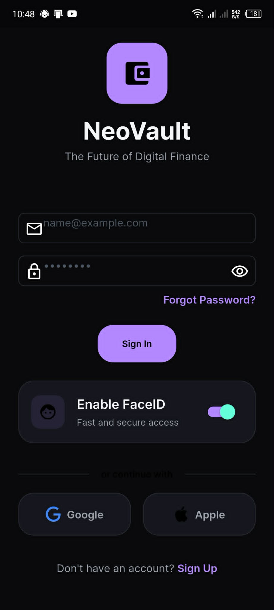 | 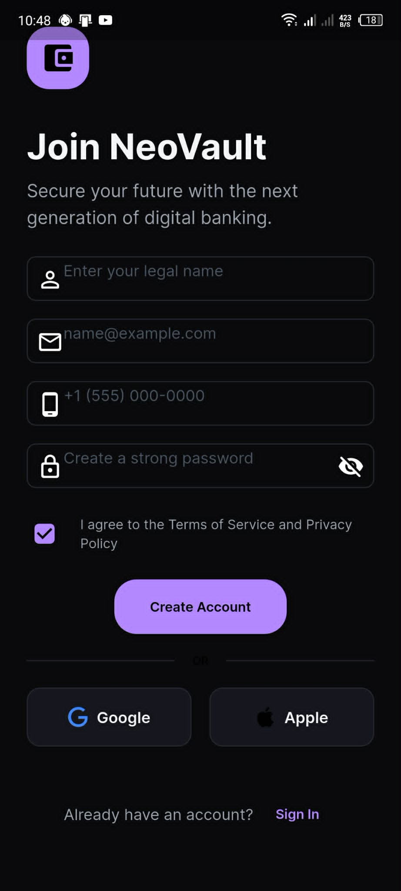 | 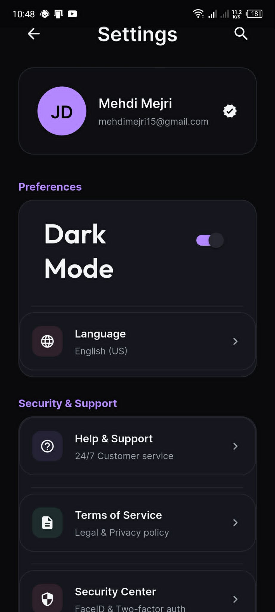 |

| Budget Limits | Add Card (OCR) | Card Parameters |
| :---: | :---: | :---: |
| 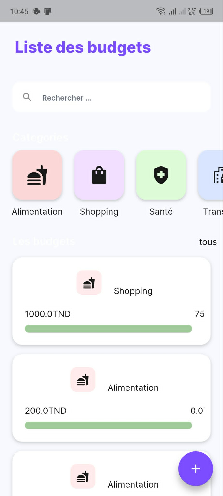 | 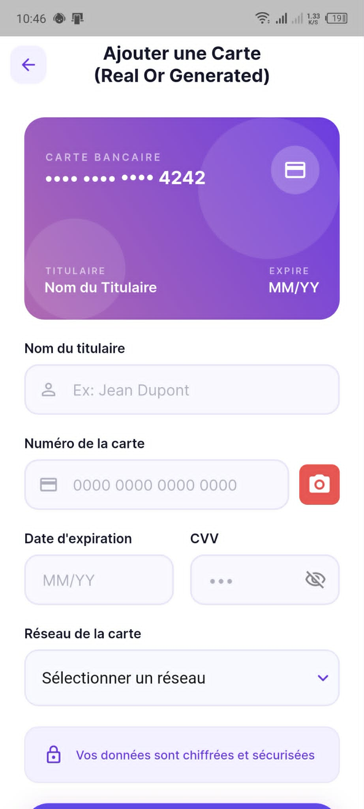 | 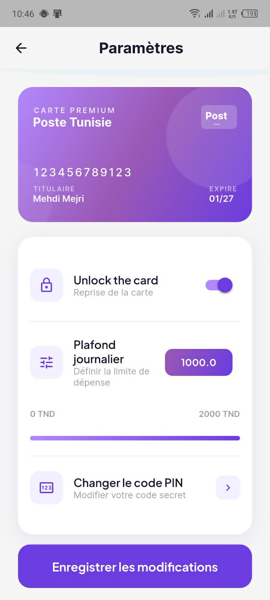 |

| New Transaction | Transaction Details + Map | Card Spending Analytics |
| :---: | :---: | :---: |
| 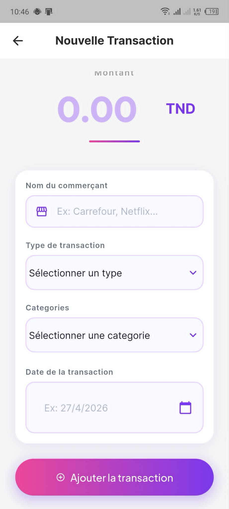 | 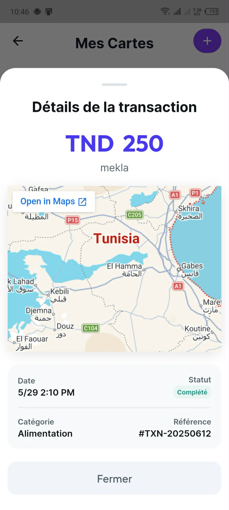 | 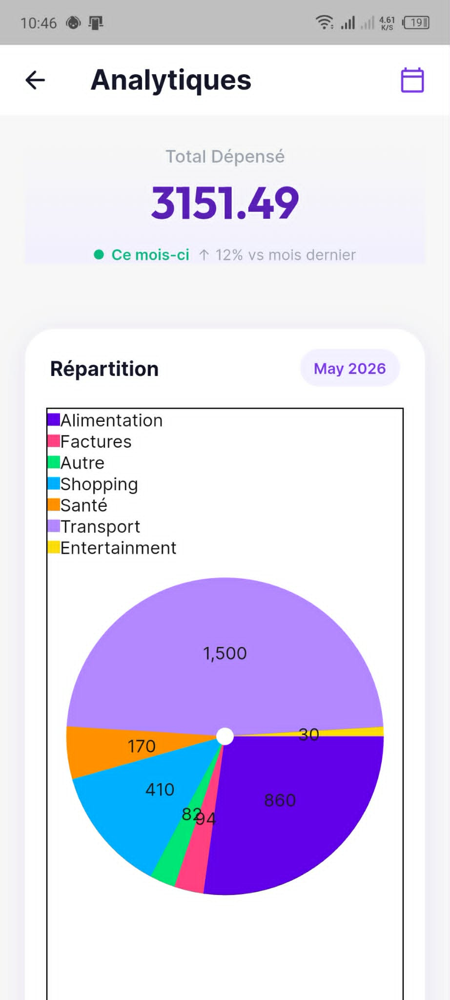 |

| Investment Portfolio | Portfolio Details | Bitcoin Live Tracker |
| :---: | :---: | :---: |
| 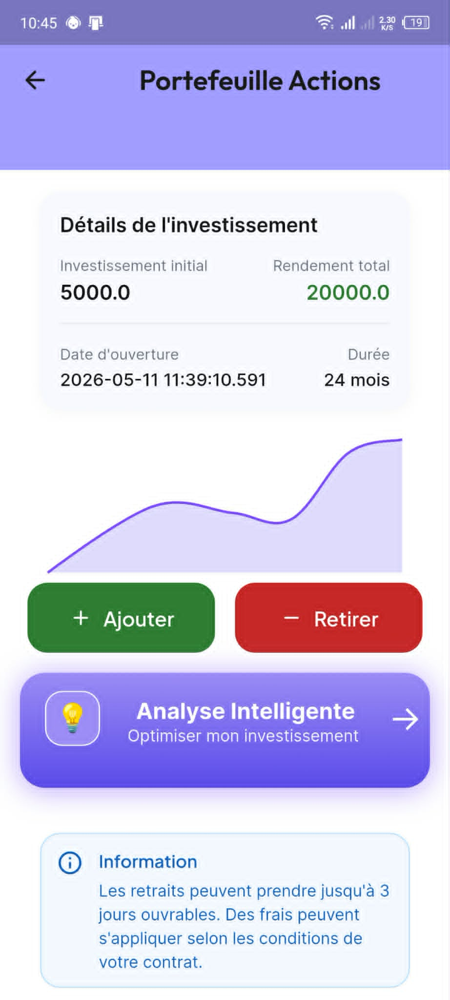 | 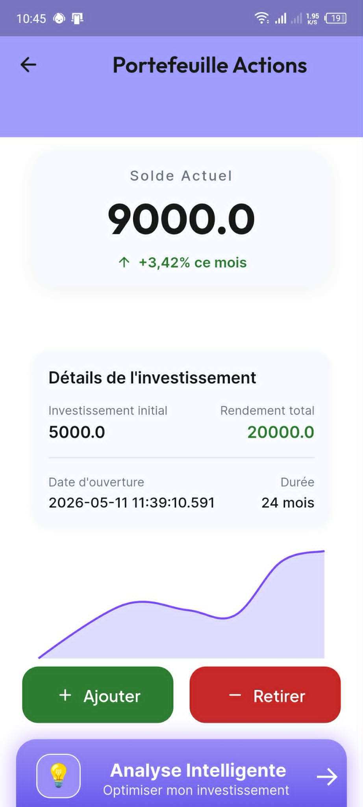 | 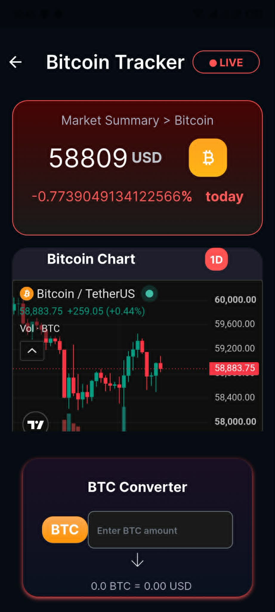 |

---

## 🚀 Key Features at a Glance

| Feature | Technology | Description |
|---|---|---|
| 💳 **On-Device Card OCR** | Google ML Kit | Scan credit cards via camera, no API needed. |
| 🤖 **AI Financial Coach** | Gemini 2.5 + Groq Llama 3.3 | Context-aware French-language budget advisory. |
| 🧾 **Receipt OCR Scanner** | OCR.space API | Auto-extract amounts and categories from paper receipts. |
| 🔒 **Biometrics + 2FA** | local_auth + Twilio SMS | FaceID / Fingerprint login with OTP verification. |
| 🗺️ **Merchant Maps** | Google Maps Embed | Interactive transaction location maps inside the app. |
| 🚨 **Fraud Detection** | Custom Heuristic Engine | Risk scoring by amount, keywords, and transaction time. |
| 💸 **Spare Change Savings** | Custom Math Logic | Rounds spending up to save micro-amounts automatically. |
| ⚖️ **Group Split Bills** | Geoapify + Cloudinary | Geolocated shared expenses with media upload. |
| 📈 **Bitcoin Tracker** | CoinGecko + TradingView | Live BTC prices with embedded candlestick charts. |
| 📄 **PDF Reports** | pdf + printing (Flutter) | Exportable A4 budget and card statement reports. |
| 💰 **Konnect Payments** | Konnect Gateway API | Recharge cards with e-DINAR (Tunisian market). |
| 🔑 **KYC Onboarding** | Firebase Firestore | National ID card capture, Base64 encoding, and pending review flow. |

---

## 🏗️ Technical Architecture & Ecosystem

NeoBank uses a **hybrid architecture** — combining on-device edge computing with Firebase cloud services and a constellation of external APIs.

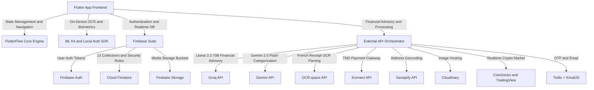

### Tech Stack Summary

| Layer | Technology | Version / Details |
|---|---|---|
| **UI Framework** | Flutter + FlutterFlow | Stable SDK `>=3.0.0 <4.0.0` |
| **State Management** | FlutterFlow App State | Reactive page-level state |
| **Backend Database** | Cloud Firestore | NoSQL Document Model |
| **Authentication** | Firebase Auth | Email/Password + Biometrics |
| **On-Device ML** | Google ML Kit | `google_mlkit_text_recognition` |
| **Charts** | fl_chart | Line, bar, and pie charts |
| **PDF Generation** | pdf + printing | A4 report export |
| **Navigation** | GoRouter | Declarative routing |

---

## 🗄️ Database Architecture — Full Firestore Schema (13 Collections)

NeoBank's data model is designed around **13 Firestore collections** with document references linking related entities.

### Entity Relationship Overview

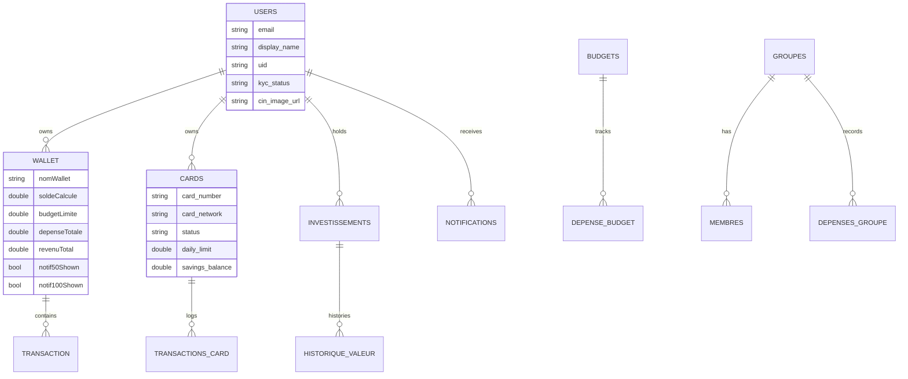

---

### 👤 `users` — User Identity & KYC

| Field | Type | Description |
|---|---|---|
| `email` | `String` | Unique login email address |
| `display_name` | `String` | User's full name |
| `uid` | `String` | Firebase Auth unique ID |
| `created_time` | `DateTime` | Profile creation timestamp |
| `phone_number` | `String` | Mobile phone number |
| `photo_url` | `String` | Profile picture URL |
| `kyc_status` | `String` | `pending` / `verified` / `rejected` |
| `cin_image_url` | `String` | Base64 or URL of national identity card (CIN) |

---

### 💼 `Wallet` — Financial Accounts

| Field | Type | Description |
|---|---|---|
| `nomWallet` | `String` | Wallet label (e.g., "Compte Principal") |
| `soldeActuel` | `double` | Raw numeric balance |
| `soldeCalcule` | `double` | Reconciled balance via atomic Firestore transactions |
| `budgetLimite` | `double` | Max monthly budget cap |
| `depenseTotale` | `double` | Aggregated total expenses |
| `revenuTotal` | `double` | Aggregated total income |
| `objectifEpargne` | `double` | Saving goal target amount |
| `texteRecu` | `String` | Temporary OCR-parsed receipt text buffer |
| `reculmage` | `String` | Base64-encoded receipt image (stored in Firestore to avoid Storage costs) |
| `notif50Shown` | `bool` | Alert flag at 50% budget consumption |
| `notif70Shown` | `bool` | Alert flag at 70% budget consumption |
| `notif90Shown` | `bool` | Alert flag at 90% budget consumption |
| `notif100Shown` | `bool` | Alert flag at 100% budget consumption |
| `Transactions` | `List<DocRef>` | References to linked `Transaction` documents |

---

### 💸 `Transaction` — Wallet Transactions

| Field | Type | Description |
|---|---|---|
| `walletReff` | `DocumentReference` | Parent `Wallet` reference |
| `type` | `String` | `revenu` (income) or `depense` (expense) |
| `categorie` | `String` | Alimentation, Transport, Santé, Achat, etc. |
| `montant` | `double` | Numeric amount in TND |
| `description` | `String` | Narrative notes |
| `dateTransaction` | `DateTime` | Date of transaction |
| `methodePaiement` | `String` | Cash, Credit Card, Cheque, etc. |
| `localisation` | `String` | Merchant text location |
| `isRecurrent` | `bool` | Recurrence toggle |
| `frequence` | `String` | `Chaque jour` / `Chaque semaine` / `Chaque mois` |
| `nextDate` | `DateTime` | Next scheduled recurrence date |

---

### 💳 `cards` — Payment Cards

| Field | Type | Description |
|---|---|---|
| `user_ref` | `DocumentReference` | Reference to cardholder's `users` record |
| `card_number` | `String` | 12–16 digit card number ("XXXX XXXX XXXX") |
| `card_holder_name` | `String` | Name printed on card |
| `expiry_date` | `String` | Expiry "MM/YY" format |
| `cvv` | `String` | 3-digit verification code |
| `card_network` | `String` | Visa, Mastercard, or Poste Tunisie |
| `balance` | `double` | Available card balance |
| `currency` | `String` | TND, USD, EUR |
| `status` | `String` | `Active` or `Blocked` |
| `daily_limit` | `double` | Max daily spending (0–2000 TND) |
| `current_spend` | `double` | Cumulative spend in current 24h cycle |
| `savings_balance` | `double` | Spare-change savings pot balance |
| `created_at` | `DateTime` | Card creation date |

---

### 🧾 `transactions` — Card Payment History

| Field | Type | Description |
|---|---|---|
| `card_ref` | `DocumentReference` | Reference to parent `cards` document |
| `merchant_name` | `String` | Merchant name |
| `amount` | `double` | Payment amount in TND |
| `type` | `String` | `debit` or `credit` |
| `category` | `String` | Alimentation, Factures, Transport, Entertainment, etc. |
| `date` | `String` / `Timestamp` | Payment date |

---

### 📊 `budgets` — Category Budget Limits

| Field | Type | Description |
|---|---|---|
| `nom` | `String` | Budget label |
| `categorie` | `String` | Alimentation, Transport, Shopping, Santé, Logement, Loisir |
| `montantMax` | `double` | Spending limit ceiling |
| `montantDepense` | `double` | Total amount spent so far |
| `montantRestant` | `double` | Remaining budget (`montantMax − montantDepense`) |
| `dateDebut` | `DateTime` | Budget start date |
| `dateFin` | `DateTime` | Budget expiry date |

---

### 💸 `depense_budget` — Budget Expense Records

| Field | Type | Description |
|---|---|---|
| `budgetRef` | `DocumentReference` | Reference to parent `budgets` document |
| `nom` | `String` | Merchant / item name |
| `montant` | `double` | Cost of purchase |
| `date` | `DateTime` | Date of purchase |
| `categorie` | `String` | Category (duplicated for indexing) |
| `description` | `String` | Notes |

---

### 👥 `groupes` — Shared Expense Groups

| Field | Type | Description |
|---|---|---|
| `nom` | `String` | Group name |
| `description` | `String` | Group purpose |
| `imageUrl` | `String` | Group avatar (Base64 or Cloud URL) |
| `lieuAdresse` | `String` | Geocoded meeting address |
| `latitude` | `double` | Geographical latitude |
| `longitude` | `double` | Geographical longitude |
| `hasLocation` | `bool` | Location enabled flag |
| `totalDepenses` | `double` | Cumulative group expenses |
| `memberCount` | `int` | Member count |
| `dateCreation` | `DateTime` | Group creation date |

---

### 👤 `membres` — Group Participants

| Field | Type | Description |
|---|---|---|
| `groupeRef` | `DocumentReference` | Reference to parent `groupes` |
| `prenom` | `String` | First name |
| `nom` | `String` | Last name |
| `fullName` | `String` | Cached full name (`prenom + nom`) |
| `avatarUrl` | `String` | Avatar image path or URL |
| `dateCreation` | `DateTime` | Join date |

---

### 🧾 `depensesGroupe` — Group Expense Transactions

| Field | Type | Description |
|---|---|---|
| `groupeRef` | `DocumentReference` | Reference to parent `groupes` |
| `montant` | `double` | Expense amount |
| `description` | `String` | Expense description |
| `payeurNom` | `String` | Name of paying member |
| `date` | `DateTime` | Date of expense |

---

### 📈 `investissements` — Investment Portfolio

| Field | Type | Description |
|---|---|---|
| `idUser` | `String` | Owner's Firebase Auth UID |
| `nom` | `String` | Investment name (e.g., "Tunisian Stocks") |
| `montantInitial` | `double` | Principal deposited |
| `montantActuel` | `double` | Current dynamic value |
| `montantCible` | `double` | Target amount goal |
| `dateDebut` | `DateTime` | Investment start date |

---

### 📉 `historique_valeur` — Asset Value History

| Field | Type | Description |
|---|---|---|
| `idInvestissement` | `DocumentReference` | Reference to parent `investissements` |
| `valeur` | `double` | Portfolio value snapshot |
| `date` | `DateTime` | Evaluation timestamp |

---

### 🔔 `notifications` — In-App Notifications

| Field | Type | Description |
|---|---|---|
| `user_ref` | `DocumentReference` | Target user reference |
| `message` | `String` | Notification body text |
| `is_read` | `bool` | Read / unread flag |
| `created_at` | `DateTime` | Timestamp |

---

## 📦 The 5 Modules — Deep Dive

### Module 1 · 💼 Wallet & Income Management (`gestion_wallet`)

> Tracks global balance sheets, cumulative incomes/expenses, and enables physical invoice scanning.

| Dashboard — Dark | Dashboard — Light |
| :---: | :---: |
|  |  |

**Advanced Business Logic:**
- **Receipt OCR Pipeline**: Encodes camera frame as Base64 → sends to OCR.space API → raw text parsed by `extractMontant` and `extractCategorie` custom Dart functions, identifying amounts and merchant categories from French receipt layouts (Carrefour, MG, Aziza, Monoprix, Clinique, Taxi).
- **Cost-Free Image Storage**: Receipt photos are encoded to Base64 using `imageToBase64` and stored directly in the `reculmage` Firestore field, avoiding Firebase Storage costs.
- **Budget Threshold Alerts**: Four boolean flags (`notif50Shown`–`notif100Shown`) on the `Wallet` document trigger in-app notifications at 50%, 70%, 90%, and 100% consumption milestones.

---

### Module 2 · 📊 Budgeting & AI Financial Advisory (`gestion_budget`)

> Sets spending caps per category and provides AI-driven financial coaching using LLMs.

| Budget List |
| :---: |
|  |

**Advanced Business Logic:**
- **Llama 3.3 70B Budget Advisor** (`GeminiAnalyseCall`): Sends budget category, target, days remaining, and current spend to Groq. Returns a structured French-language JSON with alerts, savings actions, and recommendations tailored to Tunisian spending (TND).
- **Gemini Pro Dart Action** (`analyserBudgetIA`): A native Dart custom action calling `gemini-pro:generateContent` with a financial advisory prompt — returns a styled TND-context budget assessment.
- **Structured PDF Export** (`exportBudgetPDF`): Generates A4 reports with category progress bars, color-coded risk indicators (green/orange/red), and spent/remaining ratios using the Flutter `pdf` and `printing` packages.

---

### Module 3 · 💳 Card Management & ML OCR Scanner (`gestion_cartes`)

> Manages all user cards with security controls, spending limits, transaction maps, and AI-powered fraud prevention.

| My Cards | Add Card (OCR) | Card Limits | New Transaction | Tx Details + Map | Analytics |
| :---: | :---: | :---: | :---: | :---: | :---: |
|  |  |  |  |  |  |

**Advanced Business Logic:**
- **On-Device ML Card Scanner** (`extract12DigitCard`): Activates device camera → runs `google_mlkit_text_recognition` Latin model entirely on-device. Corrects OCR errors ('O'→'0', 'l'→'1'), then applies regex to extract 12–16 digit sequences. Auto-fills card form fields in real time.
- **Luhn Algorithm Generator** (`generateCardNumber`): Produces mathematically valid Visa card numbers using the ISO/IEC 7812 Luhn (mod-10) algorithm.
- **Konnect Payment Gateway** (`InitPaymentCall`): POST to Konnect API — returns a `payUrl` redirect for card top-ups in TND (e-DINAR / bank card).
- **Geocoded Merchant Map** (`getMapUrl`): Resolves merchant names to coordinates. Wraps an `<iframe>` in a custom HTML string bypassing WebView sandbox restrictions.
- **Heuristic Fraud Detection** (`isTransactionFraudulent`): Scores transactions by amount, merchant keywords, and hour of execution — flags if risk score exceeds 75.
- **Spare Change Round-Up** (`getSpareChange`): `ceil(amount) - amount` micro-amount routed to card's `savings_balance`.
- **Card Statement PDF** (`generateStatementPDF`): Pulls Firestore transaction records and builds formatted A4 credit/debit statements.

---

### Module 4 · 👥 Shared Expense Groups (`gestion_group`)

> Group wallets for split bills — roommates, trips, events.

**Advanced Business Logic:**
- **Geoapify Geocoding** (`SearchPlaceGeoapifyCall`): GET to `https://api.geoapify.com/v1/geocode/search` — returns latitude/longitude coordinates stored on `groupes` documents, enabling geolocated expense tagging.
- **Cloudinary Media Upload** (`UploadImageToCloudinaryCall`): POST group avatars and receipt images to Cloudinary using unsigned preset. Stores returned URL in Firestore.

---

### Module 5 · 📈 Investment & Live Crypto Tracker (`gestion_invest`)

> Tracks asset portfolios, computes growth, and shows live Bitcoin data.

| Investment Details | Portfolio Balance | Bitcoin Tracker |
| :---: | :---: | :---: |
|  |  |  |

**Advanced Business Logic:**
- **TradingView Live Charts**: Flutter `WebView` embeds TradingView's interactive candlestick widget for real-time crypto visualization.
- **CoinGecko BTC Tracker** (`GetBitcoinPriceCall`): GET to `https://api.coingecko.com/api/v3/simple/price` — returns BTC/USD rate and 24h change. `calculateBTC` applies conversion rates.
- **Monthly Savings Recommendation** (`calculRecommendationMensuelle`): `(montantCible - montantActuel) / monthsRemaining` — recommends monthly deposit to hit the target goal on time.

---

## 🔒 Security, Authentication & KYC

| Sign In | Sign Up | Settings |
| :---: | :---: | :---: |
|  |  |  |

**Advanced Business Logic:**
- **Biometric Auth** (`local_auth`): Toggle in General Settings binds FaceID or Fingerprint scanner to session authentication.
- **Twilio SMS 2FA** (`SendTwilioSMSCall`): `generateOTP` produces a random 4-digit code → POST to Twilio → user enters OTP to verify identity.
- **KYC Identity Card Capture**: Camera captures user's CIN → serialized with `fileToBase64Image` → stored in `cin_image_url` with `kyc_status: "pending"` until admin review.
- **EmailJS Onboarding** (`SendWelcomeEmailCall`): POST to EmailJS API → sends a personalized welcome email upon registration.

---

## 💻 Core Business Logic — Key Algorithms

### 1 · Luhn Algorithm — Valid Card Number Generation

```dart
// Generates a Visa-prefix (4) card number passing the Luhn mod-10 check
final random = math.Random();
String digits = "4"; // Visa prefix
for (int i = 0; i < 10; i++) digits += random.nextInt(10).toString();

int sum = 0;
bool alternate = true;
for (int i = digits.length - 1; i >= 0; i--) {
  int n = int.parse(digits[i]);
  if (alternate) { n *= 2; if (n > 9) n = (n % 10) + 1; }
  sum += n;
  alternate = !alternate;
}
int checkDigit = (10 - (sum % 10)) % 10;
String full = digits + checkDigit.toString();
// Returns "XXXX XXXX XXXX"
return "${full.substring(0,4)} ${full.substring(4,8)} ${full.substring(8,12)}";
```

---

### 2 · Heuristic Fraud Detection Engine

```dart
// Scores transaction risk — flags as fraudulent if score > 75
int riskScore = 0;

// Factor 1: Transaction amount
if (amount >= 1000)      riskScore += 60;  // High risk
else if (amount >= 500)  riskScore += 30;  // Medium risk
else if (amount >= 200)  riskScore += 10;  // Low risk

// Factor 2: High-risk merchant keywords
final highRiskKeywords = [
  'crypto', 'casino', 'bet', 'pari', 'transfert inconnu', 'western union'
];
if (highRiskKeywords.any((k) => merchantName.toLowerCase().contains(k)))
  riskScore += 45;

// Factor 3: Suspicious execution hour (2 AM to 5 AM)
final hour = DateTime.now().hour;
if (hour >= 2 && hour <= 5) riskScore += 25;

return riskScore > 75; // true = flagged as fraudulent
```

**Fraud Scoring Table:**

| Trigger Condition | Risk Points Added |
|---|---|
| Amount >= 1,000 TND | +60 |
| Amount >= 500 TND | +30 |
| Amount >= 200 TND | +10 |
| High-risk merchant keyword match | +45 |
| Transaction between 2 AM and 5 AM | +25 |
| **Fraud flag threshold** | **> 75 points** |

---

### 3 · Atomic Firestore Balance Reconciliation

Prevents race conditions when wallet balances are updated concurrently across multiple sessions.

```dart
// Atomically delete a transaction and revert its effect on wallet balances
await FirebaseFirestore.instance.runTransaction((txn) async {
  final txDoc     = await txn.get(transactionRef);
  final walletDoc = await txn.get(walletRef);

  final montant = ((txDoc['montant'] ?? 0) as num).toDouble();
  final type    = (txDoc['type'] ?? '').toString()
                    .toLowerCase().trim().replaceAll('é', 'e');

  double solde    = ((walletDoc['soldeCalcule'] ?? 0) as num).toDouble();
  double depenses = ((walletDoc['depenseTotale'] ?? 0) as num).toDouble();
  double revenus  = ((walletDoc['revenuTotal']   ?? 0) as num).toDouble();

  if (type == 'depense') {
    depenses -= montant;
    solde    += montant;  // revert: add back the deducted expense
  } else if (type == 'revenu') {
    revenus -= montant;
    solde   -= montant;  // revert: subtract the added income
  }

  txn.update(walletRef, {
    'soldeCalcule': solde,
    'depenseTotale': depenses,
    'revenuTotal': revenus,
  });
  txn.delete(transactionRef); // atomic: both operations succeed or both fail
});
```

---

### 4 · On-Device ML Kit OCR — Card Number Extraction

```dart
// Uses google_mlkit_text_recognition — runs entirely on-device, zero network latency
final textRecognizer = TextRecognizer(script: TextRecognitionScript.latin);
final RecognizedText recognized = await textRecognizer.processImage(inputImage);

for (TextBlock block in recognized.blocks) {
  for (TextLine line in block.lines) {
    String cleaned = line.text
      .replaceAll('O', '0')  // Correct OCR artifact: letter O -> digit 0
      .replaceAll('l', '1')  // Correct OCR artifact: letter l -> digit 1
      .replaceAll(' ', '')   // Strip whitespace
      .replaceAll('-', '');  // Strip dashes

    // Match sequences of 12 to 16 digits (standard card number lengths)
    RegExp cardRegex = RegExp(r'\b\d{12,16}\b');
    final match = cardRegex.firstMatch(cleaned);
    if (match != null) return match.group(0); // Return extracted card number
  }
}
```

---

## 🔌 Full API Integration Table

| Service | Method | Endpoint | Purpose |
|---|---|---|---|
| **Konnect Gateway** | POST | `api.preprod.konnect.network/api/v2/payments/init-payment` | TND card top-ups via e-DINAR |
| **OCR.space** | POST | `api.ocr.space/parse/image` | French receipt text extraction |
| **Groq (Llama 3.3 70B)** | POST | `api.groq.com/openai/v1/chat/completions` | AI budget advisory in French |
| **Groq (Llama 3.1)** | POST | `api.groq.com/openai/v1/chat/completions` | Auto transaction description generator |
| **Gemini 2.5 Flash** | POST | `generativelanguage.googleapis.com/...gemini-2.5-flash:generateContent` | Merchant categorization |
| **Jina AI** | POST | `api.jina.ai/v1/classify` | Text classification fallback |
| **Geoapify** | GET | `api.geoapify.com/v1/geocode/search` | Address to coordinates lookup |
| **Cloudinary** | POST | `api.cloudinary.com/v1_1/.../image/upload` | Group image hosting |
| **EmailJS** | POST | `api.emailjs.com/api/v1.0/email/send` | Welcome / onboarding emails |
| **Twilio SMS** | POST | `api.twilio.com/.../Messages.json` | 2FA OTP SMS delivery |
| **CoinGecko** | GET | `api.coingecko.com/api/v3/simple/price` | Live BTC market price |
| **ExchangeRate API** | GET | `api.exchangerate-api.com/v4/latest/TND` | TND currency exchange rates |
| **Google ML Kit** | Local SDK | On-device (no network) | Card OCR with zero latency |

---

## ⚠️ Showcase Notice — Source Code Not Available

> **🔒 This is a Portfolio Showcase — Source Code is Intentionally Not Included**
>
> This GitHub repository contains **only** the architecture documentation, database schemas, business logic descriptions, and UI screenshots of the NeoBank application.
>
> **The full Flutter/FlutterFlow source code is intentionally withheld.** This project represents personal and academic work and is shared here exclusively to demonstrate technical design, architectural decisions, and advanced implementation capabilities.
>
> If you are interested in discussing the project or exploring collaboration, feel free to reach out via GitHub.

---

<div align="center">

**Built with ❤️ for the Tunisian fintech ecosystem**


</div>
