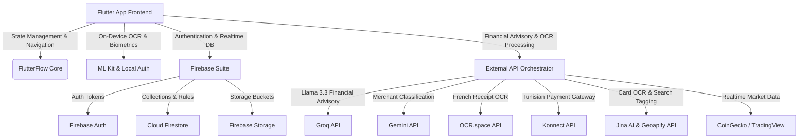

# Architecture & Advanced Technical Documentation: NeoBank (FlutterFlow & Firebase)

Welcome to the official technical blueprint and documentation for **NeoBank** (NeoVault), a premium digital banking and personal finance application designed for the Tunisian market (TND) using **FlutterFlow** and **Firebase**.

This document describes the application's layout, database schemes, API integrations, and the five core modules (**5 Gestions**), along with advanced business logic code details ("métiers avancés").

---

## 🏗️ 1. Technical Architecture & Ecosystem

NeoBank leverages a hybrid architecture combining local device computing (including edge Machine Learning) with Firebase cloud services and multiple external web API connections.



### Key Technical Specs:
* **Framework**: Flutter (Stable SDK `>=3.0.0 <4.0.0`)
* **Visuals**: FlutterFlow Theme Engine (Responsive Light & Dark Mode)
* **Backend Database**: Cloud Firestore (NoSQL Document database)
* **API Orchestration**: FlutterFlow HTTP Manager (utilizing JSON Path extracts)
* **Biometric Auth**: `local_auth` integration for FaceID/Fingerprint secure unlock.
* **On-Device OCR**: `google_mlkit_text_recognition` for local, fast payment card digit extraction.

---

## 🗄️ 2. Database Architecture (Cloud Firestore Entity Schemas)

NeoBank's data model comprises 13 distinct Firestore collections. Below is the technical breakdown of each entity schema.

### 👤 2.1 Users Collection (`users`)
Stores user identity, settings, verification (KYC), and onboarding status.
* **Path**: `/users/{userId}`
* **Fields**:
  | Field Name | Data Type | Description |
  |---|---|---|
  | `email` | `String` | Unique login email address. |
  | `display_name`| `String` | User's full name. |
  | `uid` | `String` | Unique authentication ID (Firebase Auth). |
  | `created_time`| `DateTime` | Profile creation timestamp. |
  | `phone_number`| `String` | User mobile number. |
  | `photo_url` | `String` | URL of profile picture. |
  | `kyc_status` | `String` | Verification status: `pending`, `verified`, `rejected`. |
  | `cin_image_url`| `String` | Base64-encoded or Cloud URL of user's national identity card (CIN). |

### 💼 2.2 Wallet Collection (`Wallet`)
Tracks the user's financial accounts, cumulative totals, saving goals, and OCR parsing buffers.
* **Path**: `/Wallet/{walletId}`
* **Fields**:
  | Field Name | Data Type | Description |
  |---|---|---|
  | `nomWallet` | `String` | Wallet label (e.g., "Compte Principal"). |
  | `soldeActuel` | `double` | Un-cached numeric balance. |
  | `budgetLimite` | `double` | Max monthly budget cap associated with this wallet. |
  | `depenseTotale`| `double` | Aggregated total expenses. |
  | `revenuTotal` | `double` | Aggregated total income. |
  | `objectifEpargne`| `double` | Saving target goal amount. |
  | `soldeCalcule` | `double` | Reconciled running balance computed via Firestore Transactions. |
  | `texteRecu` | `String` | Temporary text parsed from OCR scans. |
  | `reculmage` | `String` | Base64 representation of scanned receipt image. |
  | `notif50Shown` | `bool` | Flag: alert triggered when expenses exceed 50% of budget limit. |
  | `notif70Shown` | `bool` | Flag: alert triggered when expenses exceed 70% of budget limit. |
  | `notif90Shown` | `bool` | Flag: alert triggered when expenses exceed 90% of budget limit. |
  | `notif100Shown`| `bool` | Flag: alert triggered when expenses exceed 100% of budget limit. |
  | `Transactions` | `List<DocRef>`| References list to associated `Transaction` documents. |

### 💸 2.3 Wallet Transactions Collection (`Transaction`)
Tracks transactions modifying the user's wallets.
* **Path**: `/Transaction/{transactionId}`
* **Fields**:
  | Field Name | Data Type | Description |
  |---|---|---|
  | `walletReff` | `DocumentReference` | Reference to parent `Wallet`. |
  | `type` | `String` | Direction of cash flow: `revenu` (income) or `depense` (expense). |
  | `categorie` | `String` | Category label: Alimentation, Transport, Santé, Achat, etc. |
  | `montant` | `double` | Numeric amount. |
  | `description` | `String` | Narrative/notes for transaction. |
  | `dateTransaction`| `DateTime` | Date of transaction. |
  | `methodePaiement`| `String` | Payment mechanism (e.g., Credit Card, cash, cheque). |
  | `localisation` | `String` | Text-based merchant location. |
  | `isRecurrent` | `bool` | Recurrence toggle. |
  | `frequence` | `String` | Frequency rules: `Chaque jour`, `Chaque semaine`, `Chaque mois`. |
  | `nextDate` | `DateTime` | Scheduled execution date for recurring trigger. |

### 📈 2.4 Cards Collection (`cards`)
Represents the user's debit/credit cards, limits, and linked savings pot.
* **Path**: `/cards/{cardId}`
* **Fields**:
  | Field Name | Data Type | Description |
  |---|---|---|
  | `user_ref` | `DocumentReference` | Reference to the cardholder's `users` record. |
  | `card_number` | `String` | 12-to-16 digit card number formatted as "XXXX XXXX XXXX". |
  | `card_holder_name`| `String` | Name printed on card. |
  | `expiry_date` | `String` | Expiry formatted as "MM/YY". |
  | `cvv` | `String` | 3-digit card verification code. |
  | `card_network` | `String` | Visa, Mastercard, or Poste Tunisie. |
  | `balance` | `double` | Remaining funds on card. |
  | `currency` | `String` | Card currency code (e.g., TND, USD, EUR). |
  | `status` | `String` | Switch status: `Active`, `Blocked`. |
  | `daily_limit` | `double` | Maximum allowed daily spending cap. |
  | `current_spend`| `double` | Cumulative spending in current 24h cycle. |
  | `savings_balance`| `double` | Separate savings pot balance accumulated via spare change rounding. |
  | `created_at` | `DateTime` | Creation date. |

### 🧾 2.5 Card Transactions Collection (`transactions`)
Logs debit card merchant payments. Separated from wallet logs for transaction grouping.
* **Path**: `/transactions/{transactionId}`
* **Fields**:
  | Field Name | Data Type | Description |
  |---|---|---|
  | `card_ref` | `DocumentReference` | Reference to parent `cards` record. |
  | `merchant_name`| `String` | Name of merchant. |
  | `amount` | `double` | Payment amount in TND. |
  | `type` | `String` | Transaction type: `debit` or `credit`. |
  | `category` | `String` | Categorization: Alimentation, Factures, Transport, Entertainment, etc. |
  | `date` | `String` / `Timestamp` | Payment date. |

### 📊 2.6 Budgets Collection (`budgets`)
Tracks category-specific budget bounds.
* **Path**: `/budgets/{budgetId}`
* **Fields**:
  | Field Name | Data Type | Description |
  |---|---|---|
  | `nom` | `String` | Name of budget. |
  | `categorie` | `String` | Category label: Alimentation, Transport, Shopping, Santé, Logement, Loisir. |
  | `montantMax` | `double` | Upper limit spending constraint. |
  | `montantDepense`| `double` | Aggregated spent funds. |
  | `montantRestant`| `double` | Calculated remaining funds (`montantMax - montantDepense`). |
  | `dateDebut` | `DateTime` | Starting day. |
  | `dateFin` | `DateTime` | Expiration day. |

### 💸 2.7 Budget Expenses Collection (`depense_budget`)
Contains specific purchases billed against a budget limits.
* **Path**: `/depense_budget/{expenseId}`
* **Fields**:
  | Field Name | Data Type | Description |
  |---|---|---|
  | `budgetRef` | `DocumentReference` | Reference to parent `budgets` record. |
  | `nom` | `String` | Merchant or item name. |
  | `montant` | `double` | Cost of item. |
  | `date` | `DateTime` | Date of purchase. |
  | `categorie` | `String` | Duplicated budget category for indexing. |
  | `description` | `String` | Notes. |

### 👥 2.8 Groups Collection (`groupes`)
Represents shared expense wallets for split bills.
* **Path**: `/groupes/{groupId}`
* **Fields**:
  | Field Name | Data Type | Description |
  |---|---|---|
  | `nom` | `String` | Group name. |
  | `description` | `String` | Short purpose text. |
  | `imageUrl` | `String` | Base64-encoded group picture or Cloud URL. |
  | `lieuAdresse` | `String` | Geocoded string address of group meetings. |
  | `latitude` | `double` | Geographical latitude. |
  | `longitude` | `double` | Geographical longitude. |
  | `hasLocation` | `bool` | Flag: whether group has meetings geolocation. |
  | `totalDepenses`| `double` | Running cumulative expenses inside group. |
  | `memberCount` | `int` | Total number of members. |
  | `dateCreation` | `DateTime` | Creation date. |

### 👤 2.9 Group Members Collection (`membres`)
Detailed profile records of split-bill participants linked to a group.
* **Path**: `/membres/{memberId}`
* **Fields**:
  | Field Name | Data Type | Description |
  |---|---|---|
  | `groupeRef` | `DocumentReference` | Reference to parent `groupes`. |
  | `prenom` | `String` | First name. |
  | `nom` | `String` | Last name. |
  | `fullName` | `String` | Full name cache (`prenom + nom`). |
  | `avatarUrl` | `String` | Avatar image path or URL. |
  | `dateCreation` | `DateTime` | Joined date. |

### 🧾 2.10 Group Expenses Collection (`depensesGroupe`)
Transactions posted inside shared groups.
* **Path**: `/depensesGroupe/{expenseId}`
* **Fields**:
  | Field Name | Data Type | Description |
  |---|---|---|
  | `groupeRef` | `DocumentReference` | Reference to parent `groupes`. |
  | `montant` | `double` | Cost of expense. |
  | `description` | `String` | Description of expense. |
  | `payeurNom` | `String` | Name of member who paid. |
  | `date` | `DateTime` | Date of expense. |

### 📈 2.11 Investments Collection (`investissements`)
Tracks portfolio balances, target amounts, and growth goals.
* **Path**: `/investissements/{investmentId}`
* **Fields**:
  | Field Name | Data Type | Description |
  |---|---|---|
  | `idUser` | `String` | Owner's Firebase Auth UID. |
  | `nom` | `String` | Investment name (e.g., "Tunisian Stocks", "Crypto"). |
  | `montantInitial`| `double` | Principal amount deposited. |
  | `montantActuel` | `double` | Dynamic asset value. |
  | `montantCible` | `double` | Target amount goal. |
  | `dateDebut` | `DateTime` | Opening date. |

### 📉 2.12 Investment Value History (`historique_valeur`)
Sub-collection tracking changes in asset value to render line charts.
* **Path**: `/historique_valeur/{historyId}`
* **Fields**:
  | Field Name | Data Type | Description |
  |---|---|---|
  | `idInvestissement`| `DocumentReference` | Reference to parent `investissements` record. |
  | `valeur` | `double` | Volatile portfolio valuation at index. |
  | `date` | `DateTime` | Timestamp of evaluation. |

### 🔔 2.13 Notifications Collection (`notifications`)
Logs in-app alerts and notifications.
* **Path**: `/notifications/{notificationId}`
* **Fields**:
  | Field Name | Data Type | Description |
  |---|---|---|
  | `user_ref` | `DocumentReference` | Reference to target `users` account. |
  | `message` | `String` | Notification copy. |
  | `is_read` | `bool` | Read state flag. |
  | `created_at` | `DateTime` | Timestamp. |

---

## 📦 3. Core Modules Deep Dive (The 5 Gestions)

NeoBank is structured into five distinct operational domains that implement advanced user-facing features and server integrations.

### 💰 Module 1: Wallet & Income Management (`gestion_wallet`)
Tracks global balance sheets, manual entries, and supports automatic digital scanning of physical invoices.

* **Key Files**: 
  - [add_revenu/add_revenu_widget.dart](file:///f:/Downloads/New%20folder%20(27)/neo_bank/lib/gestion_wallet/add_revenu/add_revenu_widget.dart)
  - [wallet_dashboard/wallet_dashboard_widget.dart](file:///f:/Downloads/New%20folder%20(27)/neo_bank/lib/gestion_wallet/wallet_dashboard/wallet_dashboard_widget.dart)
* **Advanced "Métiers" Logic**:
  * **Digital Invoice Scanning (OCR)**: Integrates `ScanRecuOCRCall` mapping Base64 receipt string into a parseable stream. Calls `extractMontant` and `extractCategorie` custom functions locally to parse receipt parameters dynamically.
  * **Free Storage Workaround**: To upload receipts without incurring Firebase Storage transfer fees, the custom function `imageToBase64` compiles raw camera bytes into a Base64 string with the `data:image/png;base64,` prefix. This is stored directly in a Firestore text field (`reculmage` in `Wallet`).
* **Visual Screens**:
  * **Main Dashboard Layout (Dark & Light Modes)**: Shows the current cash balance, weekly spend curve, horizontal scrolling modules, activity log, and quick actions.
    * *Dark Mode View*: ``
    * *Light Mode View*: ``

---

### 📊 Module 2: Budgeting & AI Financial Advisory (`gestion_budget`)
Enables user budget caps per category, analyzes cash-out patterns, and integrates an AI coach that offers savings advice.

* **Key Files**:
  - [finance/finance_widget.dart](file:///f:/Downloads/New%20folder%20(27)/neo_bank/lib/gestion_budget/finance/finance_widget.dart)
  - [detailles_budget/detailles_budget_widget.dart](file:///f:/Downloads/New%20folder%20(27)/neo_bank/lib/gestion_budget/detailles_budget/detailles_budget_widget.dart)
  - [analyse_i_a_sheet/analyse_i_a_sheet_widget.dart](file:///f:/Downloads/New%20folder%20(27)/neo_bank/lib/gestion_budget/analyse_i_a_sheet/analyse_i_a_sheet_widget.dart)
* **Advanced "Métiers" Logic**:
  * **Groq Llama 3.3 Financial Advisory (`GeminiAnalyseCall`)**: Evaluates budget categories, target values, days left, and current spent totals. Queries Llama 3.3 70B on Groq to return detailed French analysis formatted as clean JSON.
  * **Gemini Pro Budget Analyzer (`analyserBudgetIA`)**: A custom Dart client action that runs a budget assessment with Gemini Pro (`gemini-pro:generateContent`). Provides a customized Tunisian Dinar (TND) financial report.
  * **Structured PDF Reports (`exportBudgetPDF`)**: Generates an A4 budget summary using `pdf` and `printing` packages. Shows budget metrics, spent/remaining ratios, color indicators, progress bars, and print options.
* **Visual Screens**:
  * **Budget List Screen**: Displays category-specific budget limits (e.g., Alimentation, Shopping) with progress bars showing spent amounts.
    * *Screen Image*: ``

---

### 💳 Module 3: Card Management & ML OCR Reader (`gestion_cartes`)
Manages user payment cards, locks, sliders for spending controls, maps transaction locations, flags fraud risk, and recharges cards via local gateways.

* **Key Files**:
  - [the_main_mes_cartes_dashboard_view_cards_transactions/the_main_mes_cartes_dashboard_view_cards_transactions_widget.dart](file:///f:/Downloads/New%20folder%20(27)/neo_bank/lib/gestion_cartes/the_main_mes_cartes_dashboard_view_cards_transactions/the_main_mes_cartes_dashboard_view_cards_transactions_widget.dart)
  - [ajouterune_carte_form_createa_new_card/ajouterune_carte_form_createa_new_card_widget.dart](file:///f:/Downloads/New%20folder%20(27)/neo_bank/lib/gestion_cartes/ajouterune_carte_form_createa_new_card/ajouterune_carte_form_createa_new_card_widget.dart)
  - [paramtresdela_carte_update_card_limits_status/paramtresdela_carte_update_card_limits_status_widget.dart](file:///f:/Downloads/New%20folder%20(27)/neo_bank/lib/gestion_cartes/paramtresdela_carte_update_card_limits_status/paramtresdela_carte_update_card_limits_status_widget.dart)
  - [dtailsdela_transaction/dtailsdela_transaction_widget.dart](file:///f:/Downloads/New%20folder%20(27)/neo_bank/lib/gestion_cartes/dtailsdela_transaction/dtailsdela_transaction_widget.dart)
  - [analytiques_transactions/analytiques_transactions_widget.dart](file:///f:/Downloads/New%20folder%20(27)/neo_bank/lib/gestion_cartes/analytiques_transactions/analytiques_transactions_widget.dart)
* **Advanced "Métiers" Logic**:
  * **On-Device ML Kit OCR Card Scanner (`extract12DigitCard`)**: Triggers native device camera input utilizing `google_mlkit_text_recognition` Latin script. Pre-processes read lines, corrects AI character errors (e.g. replacing 'O' with '0', 'l' with '1'), strips punctuation, extracts 12-to-16 card numbers via Regex, and auto-fills registration form inputs in real-time.
  * **Luhn Algorithm Card Generator (`generateCardNumber`)**: Runs the mathematical Luhn algorithm (mod 10 check digit verification) to generate cards starting with prefix "4" (Visa), formatted as "XXXX XXXX XXXX".
  * **Konnect Payment gateway Recharge (`InitPaymentCall`)**: Post payload requests to the Konnect Network API. Returns redirect payment page URLs (`payUrl`), allowing users to recharge their cards online using e-DINAR or bank cards.
  * **Geocoded Map Embed (`getMapUrl`)**: Resolves transaction merchant names to physical locations. Constructs custom HTML wrappers that bypass mobile WebView sandboxing to embed interactive maps.
  * **Heuristic Fraud Detection (`isTransactionFraudulent`)**: Automatically flags high-risk transaction attempts. The algorithm scores transactions based on:
    * Amount size (Amount >= 1000 TND: +60 risk points; Amount >= 500 TND: +30 points).
    * High-risk merchant terms (e.g., 'crypto', 'casino', 'bet', 'Western Union': +45 points).
    * Hour of execution (2:00 AM - 5:00 AM: +25 points).
    * Transactions with scores exceeding 75 points are flagged as fraudulent.
  * **Spare Change Round-Up Savings (`getSpareChange`)**: Computes the difference between a purchase amount and its next integer ceiling (e.g. purchase of 14.20 TND yields 0.80 TND). Automatically routes this spare change to a linked card savings pot (`savings_balance`).
  * **Card Statement PDF generator (`generateStatementPDF`)**: Queries payment records from the Firestore `transactions` collection, computes a transaction list, formats credit/debit balances, and outputs native statements.
* **Visual Screens**:
  * **My Cards Dashboard Screen**: Displays active cards with quick buttons to top-up, lock/unlock, edit settings, delete, and view analytics. Shows card status and daily limit bars.
    * *Screen Image*: ``
  * **Add Card Screen**: Displays card previews updating in real-time. Includes inputs for Cardholder name, Card Number (with camera scanning trigger), Expiry, CVV, and Card Network.
    * *Screen Image*: ``
  * **Card Limits & Parameters Screen**: Slider controls for card status and daily spending limits.
    * *Screen Image*: ``
  * **New Transaction Form Screen**: Input fields for recording new transactions against a card.
    * *Screen Image*: ``
  * **Transaction Details Sheet**: Bottom sheet showing transaction amounts, details, and geolocated maps of Tunisian merchants.
    * *Screen Image*: ``
  * **Card Transaction Analytics**: Displays total monthly spending, change rates, and breakdown pie charts.
    * *Screen Image*: ``

---

### 👥 Module 4: Shared Expense Groups (`gestion_group`)
Facilitates group wallets for split bills between tenants, travel companions, and friends.

* **Key Files**:
  - [b_a_s_e_split_expenses_groups/b_a_s_e_split_expenses_groups_widget.dart](file:///f:/Downloads/New%20folder%20(27)/neo_bank/lib/gestion_group/b_a_s_e_split_expenses_groups/b_a_s_e_split_expenses_groups_widget.dart)
  - [g_e_s_t_i_o_n_g_r_o_u_p_e_s_group_details2/g_e_s_t_i_o_n_g_r_o_u_p_e_s_group_details2_widget.dart](file:///f:/Downloads/New%20folder%20(27)/neo_bank/lib/gestion_group/g_e_s_t_i_o_n_g_r_o_u_p_e_s_group_details2/g_e_s_t_i_o_n_g_r_o_u_p_e_s_group_details2_widget.dart)
* **Advanced "Métiers" Logic**:
  * **Geoapify Meetups Address Geocoding (`SearchPlaceGeoapifyCall`)**: Calls the Geoapify API (`https://api.geoapify.com/v1/geocode/search`) to parse address queries, returning latitude and longitude to tag group meetup places.
  * **Cloudinary Media Storage Integration (`UploadImageToCloudinaryCall`)**: Uploads group receipts or group avatars to Cloudinary using secure presets. Returns a URL stored directly in Firestore.

---

### 📈 Module 5: Investment & Live Crypto Tracker (`gestion_invest`)
Logs investment assets, computes recommendations, and displays live price charts.

* **Key Files**:
  - [dashboardinvestments/dashboardinvestments_widget.dart](file:///f:/Downloads/New%20folder%20(27)/neo_bank/lib/gestion_invest/dashboardinvestments/dashboardinvestments_widget.dart)
  - [invdetails/invdetails_widget.dart](file:///f:/Downloads/New%20folder%20(27)/neo_bank/lib/gestion_invest/invdetails/invdetails_widget.dart)
  - [bitcoin_page/bitcoin_page_widget.dart](file:///f:/Downloads/New%20folder%20(27)/neo_bank/lib/gestion_invest/bitcoin_page/bitcoin_page_widget.dart)
* **Advanced "Métiers" Logic**:
  * **Live TradingView Charts Integration**: Uses Flutter WebViews to embed TradingView cryptocurrency candle indicators. Displays dynamic charts inside the app.
  * **Live CoinGecko BTC pricing (`GetBitcoinPriceCall`)**: Queries the CoinGecko API (`/api/v3/simple/price`) to fetch live BTC/USD prices and 24-hour changes. Uses `calculateBTC` to run custom conversions.
  * **Saving Target Recommendations (`calculRecommendationMensuelle`)**: A custom math helper that evaluates the difference between a target investment goal (`montantCible`) and current progress (`montantActuel`) relative to the time remaining, recommending a monthly deposit amount to reach the user's goals.
* **Visual Screens**:
  * **Investment Details Screen**: Displays initial deposits, total gains, progress trend charts, and options to add or withdraw funds.
    * *Investment Portfolio View*: ``
    * *Asset Balance View*: ``
  * **Bitcoin Tracker Screen**: Displays market summaries, live TradingView charts, and converters.
    * *Bitcoin Tracker View*: ``

---

## 🔒 4. Security, Biometrics & Authentication

NeoBank implements a secure login flow, biometric support, and verification checks.

* **Key Files**:
  - [a_u_t_h_login/a_u_t_h_login_widget.dart](file:///f:/Downloads/New%20folder%20(27)/neo_bank/lib/authentication/a_u_t_h_login/a_u_t_h_login_widget.dart)
  - [verification2_f_a/verification2_f_a_widget.dart](file:///f:/Downloads/New%20folder%20(27)/neo_bank/lib/authentication/verification2_f_a/verification2_f_a_widget.dart)
  - [a_u_t_h_profile_setup/a_u_t_h_profile_setup_widget.dart](file:///f:/Downloads/New%20folder%20(27)/neo_bank/lib/authentication/a_u_t_h_profile_setup/a_u_t_h_profile_setup_widget.dart)
* **Advanced "Métiers" Logic**:
  * **Local Biometrics (`local_auth`)**: Toggle controls in general preferences bind device biometrics to login sessions, allowing users to login via FaceID or Fingerprint scan.
  * **Twilio 2FA Verification (`SendTwilioSMSCall`)**: Generates a secure, random 4-digit code (`generateOTP`). Sends it to the user's phone via Twilio SMS to verify transactions or logins.
  * **KYC Profile Setup**: Users must submit a picture of their national identity card (CIN). The card image is serialized to Base64 (`fileToBase64Image`) and saved in Firestore (`cin_image_url`). Sets `kycStatus: 'pending'` until verified.
  * **EmailJS onboarding integration (`SendWelcomeEmailCall`)**: Integrates EmailJS API to send customized welcome emails to users upon registration.
* **Visual Screens**:
  * **Login Screen**: Fields for email and password inputs, FaceID toggles, social login options, and links to registration.
    * *Login View*: ``
  * **Registration Screen**: Fields for name, email, phone number, password, and terms check.
    * *Register View*: ``
  * **Settings Preferences**: User profile status, dark mode toggles, language preferences, and terms links.
    * *Settings View*: ``

---

## 💾 5. Reconciliations: Firestore Database Transactions

To prevent errors from network latency, balance calculations on wallet transaction additions, edits, or deletions are managed via **Cloud Firestore atomic transactions**.

### 🗑️ Deletion Transaction (`deleteTransactionAndUpdateWallet`)
Ensures balance updates and transaction deletions are processed in a single, atomic operation.
```dart
Future deleteTransactionAndUpdateWallet(
  DocumentReference transactionRef,
  DocumentReference walletRef,
) async {
  await FirebaseFirestore.instance.runTransaction((transaction) async {
    final transactionSnap = await transaction.get(transactionRef);
    final walletSnap = await transaction.get(walletRef);

    if (!transactionSnap.exists || !walletSnap.exists) {
      throw Exception('Transaction ou Wallet introuvable');
    }

    final data = transactionSnap.data() as Map<String, dynamic>;
    final walletData = walletSnap.data() as Map<String, dynamic>;

    final montant = ((data['montant'] ?? 0) as num).toDouble();
    final type = (data['type'] ?? '').toString().toLowerCase().trim().replaceAll('é', 'e');

    double soldeCalcule = ((walletData['soldeCalcule'] ?? 0) as num).toDouble();
    double depenseTotale = ((walletData['depenseTotale'] ?? 0) as num).toDouble();
    double revenuTotal = ((walletData['revenuTotal'] ?? 0) as num).toDouble();

    // Revert balance changes based on transaction type
    if (type == 'depense') {
      depenseTotale -= montant;
      soldeCalcule += montant;
    } else if (type == 'revenu') {
      revenuTotal -= montant;
      soldeCalcule -= montant;
    }

    transaction.update(walletRef, {
      'soldeCalcule': soldeCalcule,
      'depenseTotale': depenseTotale,
      'revenuTotal': revenuTotal,
    });

    transaction.delete(transactionRef);
  });
}
```

### ✏️ Edit Transaction (`editTransactionAndUpdateWallet`)
Applies new values, reverts old transaction adjustments, and updates balances in a single transaction block.
1. **Fetch**: Fetches target transaction and wallet records.
2. **Revert**: Reverts the old transaction amount (adds back expenses, subtracts income).
3. **Apply**: Applies the new transaction amount (subtracts new expenses, adds new income).
4. **Update**: Saves transaction updates and updates wallet balances.

---

## 🔌 6. Integrations Summary (API Ecosystem)

Below is a detailed list of all external API endpoints used by NeoBank:

| Service / API | Call Name | HTTP | Endpoint URL | Description |
|---|---|---|---|---|
| **Konnect Gateway** | `Init Payment` | POST | `api.preprod.konnect.network/api/v2/payments/init-payment` | Recharges debit cards using e-DINAR. |
| **OCR.space** | `scanRecuOCR` | POST | `api.ocr.space/parse/image` | Extracts text from scanned receipt images. |
| **Groq Llama 3.3** | `GeminiAnalyse` | POST | `api.groq.com/openai/v1/chat/completions` | Generates AI financial advisory recommendations. |
| **Groq Llama 3.1** | `generateDescription` | POST | `api.groq.com/openai/v1/chat/completions` | Generates short transaction descriptions based on merchant name. |
| **Gemini 2.5 Flash** | `CategorizeTransaction`| POST | `generativelanguage.googleapis.com/.../gemini-2.5-flash:generateContent`| Classifies transaction merchant names. |
| **Jina AI** | `detectCategorieWithApi`| POST | `api.jina.ai/v1/classify` | Custom action for text categorization. |
| **Geoapify** | `SearchPlaceGeoapify` | GET | `api.geoapify.com/v1/geocode/search` | Resolves address coordinates. |
| **Cloudinary** | `UploadImageToCloudinary`| POST | `api.cloudinary.com/v1_1/dm8c2fi9i/image/upload` | Uploads group profile images. |
| **EmailJS** | `SendWelcomeEmail` | POST | `api.emailjs.com/api/v1.0/email/send` | Sends welcome email upon registration. |
| **Twilio SMS** | `SendTwilioSMS` | POST | `api.twilio.com/.../Messages.json` | Sends 2FA OTP codes. |
| **CoinGecko** | `getBitcoinPrice` | GET | `api.coingecko.com/api/v3/simple/price` | Tracks current BTC market price. |
| **ExchangeRate** | `getExchangeRates` | GET | `api.exchangerate-api.com/v4/latest/TND` | Fetches currency exchange rates. |
